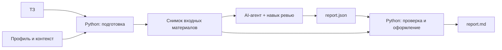

# Структура предварительной презентации

Версия 1 — черновик структуры, 2026-09-03. Это каркас выступления: что показываем, в каком порядке и на какие материалы базы опираемся. Содержание слайдов ещё не согласовано, численные результаты не получены.

Основание разделов: [реестр гипотез](../../../knowledge/hypotheses-v2.md), [план PoC](https://github.com/DanilaSaraev-git/ai-review-platform/blob/main/implementation/poc/PLAN.md), [таймлайн](../../../knowledge/roadmap.md), [план проверки](../../../knowledge/discovery-plan.md), [решения](../../../knowledge/decisions.md), [контекст-пак MTS](../context-pack.md).

Правило для всех слайдов: отделяем факт из источника, наблюдение, гипотезу и принятое решение. Ни одна гипотеза пока не проверена; численные пороги не согласованы.

---

## 1. Подход

**Слайд 1.1. Проблема и сегмент.** В командах, где аналитики готовят ТЗ для разработчиков, часть неполных и неоднозначных требований остаётся незамеченной после принятой в команде проверки. Проблемы всплывают в разработке или на тестировании, вызывая уточнения, повторные согласования и переделки. Формулировка и способ проверки — [гипотеза сегмента и проблемы](../../../knowledge/hypotheses-v2.md#гипотеза-сегмента-и-проблемы). Конкретизация для команды NET в MTS — [MTS/README.md](../../README.md#конкретизация-гипотезы-сегмента-и-проблемы). Влияние на сроки не измерено; оценка «2–3 часа» из раннего наброска не подкреплена замером.

**Слайд 1.2. Два подсегмента.** Аналитики с ИИ-агентами — доступ к ревью через команду или плагин в привычном workflow. Аналитики без ИИ-агентов — доступ через самостоятельный веб-интерфейс без специального обучения. Наличие агента не означает, что аналитик уже проверяет им ТЗ; результаты проверок ведём по подсегментам раздельно.

**Слайд 1.3. Метод работы.** Продукт развиваем через гипотезы, а не через замороженный список функций: формулировка гипотезы → минимальный способ проверки → эксперимент со свидетельствами → решение продолжить, изменить, отложить или исключить. Формат карточек SMART взят из [методики](../../../knowledge/methodology.md), workflow — из [таймлайна](../../../knowledge/roadmap.md). Статус технического этапа и статус гипотезы ведём отдельно: работающий PoC не подтверждает полезность продукта.

**Слайд 1.4. Основная гипотеза решения.** ИИ-проверка документации между подготовкой ТЗ и началом разработки сократит суммарные трудозатраты команды и задержки за счёт раннего выявления недостатков требований. Основание подхода — пирамида тестирования: в разработке уже есть практический прецедент ранних автоматизированных проверок ([The Practical Test Pyramid](https://martinfowler.com/articles/practical-test-pyramid.html), S-18). Перенос принципа на переход «аналитика → разработка» остаётся гипотезой; экономию нужно измерить.

**Слайд 1.5. Карта проработанных веток гипотез.** Показываем всё дерево и выделяем выбранную ветку.

| Группа | Ветка | Кратко | Статус в текущем составе |
| --- | --- | --- | --- |
| 1. Режимы проверки | 1.1 Простой анализ | Однократное ревью готового ТЗ с адресными замечаниями | **Выбрана в PoC** |
| | 1.2 Режим допроса | Последовательный диалог с агентом в роли разработчика вместо одного списка | Альтернатива, вне PoC |
| 2. Встраивание в рабочий процесс | 2.1 Команда или плагин для AI-агента | Проверка запускается в уже используемом агенте | **Выбрана в PoC** |
| | 2.2 Простой веб-интерфейс | Загрузка ТЗ без агента и без специального обучения | Альтернатива, вне PoC |
| 3. Обвязка агента (harness) | 3.1 Настраиваемый профиль проверки | Роль проверяющего, цель, направления проверки, шаблон документа | **Выбрана в PoC, минимальный состав** |
| | 3.2 Подключаемый контекст проекта | Шаблон, словарь, описание данных и соглашения с указанием источника и версии | **Выбрана в PoC, минимальный состав** |
| | 3.3 Библиотека типовых проблем | Карточки «фрагмент — проблема — исправление — условия» из истории корректировок | Альтернатива, вне PoC: истории правок в базе нет |
| 4. Формат результата | 4.1 Адресный список замечаний | Фрагмент, проблема, причина, вопрос, статус рассмотрения | **Выбрана в PoC** |
| | 4.2 Приоритизация замечаний | Приоритет с объяснением; весь список остаётся доступным | **Выбрана в PoC** |
| | 4.3 Новая версия документа | Черновик ТЗ с уже внесёнными согласованными исправлениями | Альтернатива, вне PoC |
| 5. Универсальность | 5.1 Переносимость между компаниями | Один продукт с адаптацией шаблонов и контекста без отдельной разработки | Проверяется после PoC; свидетельств нет |
| | 5.2 Модель заказчика и слабые модели | Подключение разрешённой модели из контура заказчика, workflow не меняется | Проверяется после PoC |
| Коммерческая | Покупатель и готовность платить | Руководитель, отвечающий за затраты и последствия ошибок в требованиях | Покупатель, бюджет и готовность платить не установлены |

**Слайд 1.6. Ранние ветки из первого контекст-пака и что с ними стало.** Одной строкой на ветку:

- **№1 «Интерактивный агент-разработчик-допросчик»** — перешла в 1.2. Кейсодатель разрешил попробовать интерактивность, но явной потребности не выразил.
- **№2 «Библиотека типовых проблем из истории корректировок»** — перешла в 3.3. Требует накопленной истории и отделения дефектов ТЗ от легитимной смены требований; материалов «до/после» пока нет.
- **№3 «Подсветка проблемных фраз»** — разобрана на независимые предположения (привязка замечания к фрагменту, проверка по шаблону, приоритизация, момент проверки) и распределена между 3.1, 4.1 и 4.2. Модель взаимодействия уточнена: аналитик пишет ТЗ, затем загружает готовый документ и получает разбор целиком, а не подсветку по мере ввода. Численные обещания точности из наброска (90–95%, 70–85%) основания не имеют и на слайды не выносятся.

**Слайд 1.7. Что выбрано первым и почему.** Для первой реализации выбран сценарий готового документа: он прямо заявлен в постановке кейса MTS, не требует интеграции с редактором и даёт артефакты для экспертной оценки. Решение зафиксировано как [D-10](../../../knowledge/decisions.md).

---

## 2. Схема решения

**Слайд 2.1. Что делаем в PoC.** Переносимый навык для AI-агента: агент читает готовое ТЗ и контекст проекта и формирует адресные замечания, а локальные скрипты проверяют структуру результата и привязки к источникам. Состав: 1.1 + 2.1 + минимум 3.1–3.2 + 4.1–4.2.

**Слайд 2.2. Схема потока.** Источник: [план PoC](https://github.com/DanilaSaraev-git/ai-review-platform/blob/main/implementation/poc/PLAN.md).

Разделение ответственности: агент выполняет смысловое ревью; код готовит документы, фиксирует источники, проверяет структуру и цитаты и формирует читаемый отчёт. Совпадение цитаты с извлечённым текстом не доказывает правильность вывода агента.

**Слайд 2.3. Формат замечания.** ID → фрагмент и место → проблема → причина и возможное последствие → вопрос для уточнения → статус «не рассмотрено» → приоритет с объяснением. Исходное ТЗ не изменяется, окончательное решение принимает человек. Для отсутствующего требования указывается проверенная область документа, а не выдуманная цитата. Отчёт отражает непрочитанные материалы и неполноту проверки.

**Слайд 2.4. Технические решения и открытые места.** Формат упаковки — Agent Skills, рабочее имя `review-data-spec`. Вход: PDF с текстовым слоем, Markdown или TXT; контекст подключается явно. Каждый запуск сохраняет собственную папку со снимком входа, манифестом (хеши исходников, версии, профиль) и результатами. Обработчик PDF не выбран: Docling и pdfplumber сравниваются отдельной задачей, преимущество не установлено. OCR, DOCX и автоматическая загрузка связанных страниц в первую версию не входят.

**Слайд 2.5. Порядок реализации.** Четыре среза с контрольными точками: подготовка документов и привязок → однократное ревью и адресный отчёт → профиль проекта и приоритеты → установка и экспертная проверка. Детали — [план PoC](https://github.com/DanilaSaraev-git/ai-review-platform/blob/main/implementation/poc/PLAN.md#план-реализации).

**Слайд 2.6. Куда это ведёт дальше.** [Таймлайн](../../../knowledge/roadmap.md): PoC → самостоятельный движок ревью (управление запуском, сменяемые LLM, повторяемость, ограничения стоимости) → сервис с фронтендом (доступ без локального агента). Этапы после PoC в статусе `planning`; их состав, порядок и необходимость могут измениться.

---

## 3. Прогресс

**Слайд 3.1. Что сделано.**

| Шаг | Результат | Где смотреть |
| --- | --- | --- |
| Собраны исходные материалы кейса | Постановка, транскрибация Q&A, тестовые документы, шаблоны и чек-лист обязательных пунктов; оригиналы сохранены без изменений | [MTS/README.md](../../README.md#источники-и-данные) |
| Проработаны гипотезы-сегменты | Одна гипотеза сегмента и два подсегмента с раздельной проверкой | [Реестр гипотез](../../../knowledge/hypotheses-v2.md#гипотеза-сегмента-и-проблемы) |
| Проработаны гипотезы-проблемы | Основная формулировка и два альтернативных ракурса — со стороны разработки и со стороны тестирования | [Контекст-пак, раздел 1](../context-pack.md#1-проблема) |
| Проработаны гипотезы-решения | Основная гипотеза, 5 групп и 11 веток, коммерческая гипотеза; у каждой — способ проверки, критерий, вопросы и поле подтверждения | [Реестр гипотез](../../../knowledge/hypotheses-v2.md#гипотезы-решения) |
| Собраны первые свидетельства | Разбор Q&A с кейсодателем, портреты пользователя и покупателя, кандидаты на замечания M-01–M-09, обзор аналогов и внешних автопроверок требований | [user-and-buyer.md](../../user-and-buyer.md), [document-analysis.md](../../document-analysis.md), [analogs.md](../../../knowledge/analogs.md) |
| Выбрана гипотеза решения для первой реализации | Простой анализ через переносимый навык: 1.1 + 2.1 + 3.1–3.2 + 4.1–4.2; границы и состав вне PoC зафиксированы | [D-10](../../../knowledge/decisions.md), [план PoC](https://github.com/DanilaSaraev-git/ai-review-platform/blob/main/implementation/poc/PLAN.md) |
| Зафиксирован маршрут развития | Таймлайн из трёх этапов и workflow изменения состава через гипотезы | [roadmap.md](../../../knowledge/roadmap.md) |

**Слайд 3.2. Что в работе.** Реализация PoC по выбранной ветке: план разбит на срезы, идёт сборка навыка и локальных скриптов. Параллельно сравниваются Docling и pdfplumber на документах MTS — результат влияет на срез подготовки документов. Перед показом статус реализации нужно сверить с фактическим состоянием репозитория.

**Слайд 3.3. Что ещё не сделано.** Не проведены интервью с действующим аналитиком, разработчиком и владельцем бюджета. Не получены история корректировок и пары «до/после». Нет независимого контрольного документа и экспертной разметки. Численные критерии, выборка, сроки и ответственные не согласованы.

---

## 4. Результаты

**Заполнить после тестирования PoC.** Измеренных результатов пока нет: эксперименты не проведены. Ниже — заготовка слайдов, чтобы после прогона подставить факты, а не переписывать структуру.

**Слайд 4.1. Условия прогона (заполнить).** Дата, версия навыка и обработчика документов, среда и модель, выбранный профиль, документы и их происхождение, кто оценивал результат.

**Слайд 4.2. Технический результат (заполнить).** Проходит ли полный сценарий в чистой рабочей папке; воспроизводимость привязок при неизменном входе; отклонение выдуманных цитат и несуществующих источников; поведение на пустом и повреждённом файле; неизменность исходного ТЗ.

**Слайд 4.3. Содержательный результат (заполнить).** Экспертная оценка замечаний по заранее согласованным правилам.

| Измерение | Значение | Ограничение |
| --- | --- | --- |
| Доля полезных замечаний | — | При нулевом знаменателе «не определено»; показывать и абсолютные числа |
| Покрытие известных проблем | — | Без эталонной разметки оценить нельзя; сама разметка может быть неполной |
| Новые полезные находки | — | Хранить отдельно от покрытия исходного эталона |
| Пропуски и ложные срабатывания | — | Нужны согласованные определения и правила дедупликации |
| Обоснованность приоритета | — | Шкала приоритетов экспертами не откалибрована |
| Время аналитика на разбор | — | Быстрая генерация не означает экономию времени пользователя |

Определения и ограничения измерений — [план проверки](../../../knowledge/discovery-plan.md#предлагаемые-измерения).

**Слайд 4.4. Что результат PoC не доказывает (оставить и после заполнения).** Работоспособность сценария не подтверждает экономию, регулярное использование, спрос, готовность платить и переносимость на другие компании. Примеры MTS после использования при настройке не являются независимым контрольным набором. Статусы продуктовых гипотез остаются «не проверена» до отдельных экспериментов.

**Слайд 4.5. Следующий шаг после прогона (заполнить).** Какие гипотезы продолжаем, что меняем, что откладываем или исключаем и на каком основании.

**Слайд 4.6. Модель денежного эффекта (показывать как модель, не как результат).** Расчёт ведётся в книге `МТС_AI_Reviwe.xlsx`: число ТЗ в месяц, доля возвратов, часы аналитика и разработчика и ставки дают стоимость исправления ТЗ, а колонки «до» и «после» — разницу за месяц на одну команду. Ставки часа выведены на отдельной вкладке «База ставок» из медианных зарплат Middle системного аналитика и Middle бэкенд-разработчика по Хабр Карьере с учётом страховых взносов и нормы рабочего времени 2026 года: 1617 и 1747 ₽/ч. При текущих допущениях получается 19 924 ₽ против 517 ₽, эффект около 19 407 ₽ в месяц. Показатели процесса не замерены, ставки являются рыночными медианами, а не ставками MTS, стоимость самой проверки в модели не учтена, поэтому цифры выносим только с пометкой «модель на допущениях» и вместе со списком показателей, которые предстоит замерить. Разбор книги и ограничения — [расчёт экономического эффекта](../../../knowledge/economics.md).

---

## 5. Риски

Слайд-таблица; при показе оставить 5–7 верхних строк, остальные держать в резерве для вопросов.

| Риск | Почему он реален | Что делаем |
| --- | --- | --- |
| Значимость проблемы не измерена | Частота возвратов и трудозатраты не замерены; оценка «2–3 часа» основания не имеет | Разобрать реальный возврат с аналитиком, разработчиком и тестировщиком до масштабирования |
| Нет независимого контроля качества | Примеры MTS уже использованы в анализе и настройке; экспертной разметки нет | Запросить новый контрольный документ, связанные версии держать в одной части набора |
| Нет истории корректировок | Пар «до/после» и подтверждённых замечаний в базе нет | Запросить материалы; ветка 3.3 остаётся вне PoC до их появления |
| Ложные срабатывания на намеренных умолчаниях | Часть полей и разделов автор опускает сознательно, а агент отметит это как пробел | Явная пометка «не применимо» в шаблоне и фиксация умолчаний в контексте проекта (3.2) |
| Малосодержательные замечания | По опыту кейсодателя, LLM отмечают общепонятную терминологию вместо содержательных проблем; заказчик отдельно требует не ограничиваться общими советами | Профиль проверки, контекст проекта и обязательная привязка к фрагменту |
| Приоритизация отсечёт важное | Пожелание «10–15 замечаний» — приблизительная оценка, а не правило скрывать остальное; шкала не откалибрована | Сортировать, но сохранять весь список; приоритет с объяснением и отдельно от подтверждения человеком |
| Ограничения ИБ и внутреннего контура | Встраивание плагинов или MCP в закрытый контур кейсодатель оценивает примерно в месяц; вопросы вплоть до бюджета открыты | Держать веб-канал 2.2 как альтернативу; условия развёртывания выяснять по каждому клиенту отдельно |
| Канал доставки может не подойти | Команда кейсодателя с ИИ-агентами сейчас не работает, VS Code аналитики используют мало | Проверять 2.1 и 2.2 как две отдельные гипотезы, не выбирая канал заранее |
| Качество извлечения из PDF | Обработчик не выбран; таблицы, переносы в ячейках и порядок чтения искажаются, привязки могут ломаться между версиями обработчика | Отдельное сравнение Docling и pdfplumber; исходный результат обработчика сохраняем для диагностики |
| Текст ТЗ как источник инструкций агенту | Проверяемый документ целиком попадает в контекст модели | Тексты документов считаем данными, а не инструкциями; проверяем это отдельным тестом |
| Переносимость на другие компании | Свидетельств за пределами MTS нет, интервью в других компаниях не проводились | Ветка 5.1 проверяется отдельно; смоделированное интервью свидетельством не считается |
| Работа на слабых моделях заказчика | Наличие внутреннего контура и выбора моделей подтверждено, работоспособность полного workflow — нет | Ветка 5.2 с прогоном на моделях разных классов |
| Покупатель не установлен | Владелец бюджета, полномочия и готовность платить неизвестны | Разговор с кандидатом на покупателя вынесен в ближайшие шаги |

---

## 6. Команда

Распределение ролей взято из исходного набросока команды; колонка вклада на текущем этапе — предложение, а не назначение задач.

| Участник | Роль | Вклад на этапе анализа и PoC |
| --- | --- | --- |
| Даня | Организация работы, помощь в реализации, экономический расчёт | Ведение артефактов и задач, база знаний и реестр гипотез, сбор исходных затрат для [расчёта эффекта](../../../knowledge/economics.md) |
| Влад | Технические решения, архитектура | Технические гипотезы и ограничения, схема PoC, выбор обработчика документов |
| Алёна | Презентация, конкуренты и концепции, требования, применение в других сферах | Обзор аналогов и альтернатив, аргументация, проверка переносимости за пределы первого клиента |

**Как используем ИИ в работе.** Систематизация источников, сопоставление утверждений, подготовка вопросов, формулировки гипотез и кандидаты на замечания с привязкой к фрагментам. Выводы ИИ проверяем по оригиналам и с экспертами; они не заменяют интервью, измерения и решения команды.

**Как предполагаем использовать ИИ в продукте.** Модель отвечает за интерпретацию требований, поиск неоднозначностей, объяснения и вопросы. Загрузка, хранение, статусы и однозначные формальные проверки выполняются обычным кодом. Это рабочее разделение задач, а не выбранная архитектура.

---

## Что уточнить до показа

- Сверить статус реализации PoC с фактическим состоянием репозитория: план подготовлен, объём готового кода нужно подтвердить.
- Дождаться результата сравнения Docling и pdfplumber и подставить выбранный обработчик в слайд 2.4.
- Согласовать, что считаем полезным замечанием, пропуском и дублем, — до прогона, а не после.
- Назначить, кто проводит интервью, собирает версии документов и организует экспертную оценку.
- Решить, какие численные значения выносим на слайды: несогласованные пороги и оценки без основания не выносим. Для слайда 4.6 отдельно решить, выносим ли рублёвый итог модели или только перечень показателей, влияющих на эффект.
